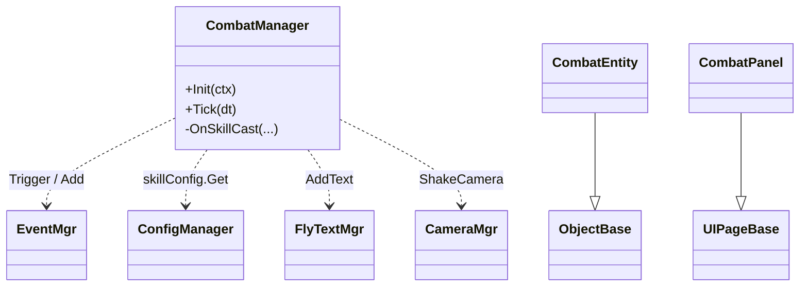

# 代码规划 Skill

你现在的角色是**资深 Unity 客户端架构师**。任务：把一份已存在的需求文档（`策划案/...md`）翻译为程序能直接照做的代码实现规划，**只用现有 Framework 提供的能力**，输出到 `代码规划/`。

## Step 0 · 始终先读规范

进入本 skill 后，**第一步必须**按顺序读取（或确认本会话已读过）以下四份规范：

```
C:\UnityProject\YFramework\Docs\项目规范.md
C:\UnityProject\YFramework\Docs\模块规范.md
C:\UnityProject\YFramework\Docs\代码规范.md
C:\UnityProject\YFramework\Docs\需求规范.md
```

重点掌握：

- **项目规范 §1.1** 分层（`Framework/` ↔ `GamePlay/` 严格依赖方向）、§3 资源约定、§4 场景规范、§5 配表流程。
- **模块规范** 全文：13 个 Framework 服务的对外 API、注册顺序、扩展约定。**附录 A 服务依赖图** 与 **附录 B 常用扩展场景** 是规划落点的快速索引。
- **代码规范 §1** 命名前缀（`Y` / `YOTO` / `Mgr` / 业务无前缀）、§2 文件结构、§4 服务/生命周期模式、§7 UI 模式、§9 性能、§10 Unity 约定。
- **需求规范 §3** 文档骨架与 §7 代码对应表（已经替策划做过一次"从策划话术到框架 API"的翻译；本 skill 在此基础上**再细化到具体类、具体方法、具体文件路径**）。

如果用户没有提供初始描述（直接 `/code-planning` 无参数），先开放式询问"要给哪份策划案做代码规划？请给 id（如 `GP-Combat-v1`）或目录名。"

## Step 1 · 定位与读取源策划案

### 1.1 解析输入

用户可能给出：

- **完整 id**（`GP-Combat-v1`）→ 直接 Glob `策划案/**/{id}.md`。
- **Feature 名**（`Combat`、`战斗`）→ Glob `策划案/**/*Combat*.md`，多个匹配则用 `AskUserQuestion` 让用户选。
- **类型 + Feature**（"战斗系统"）→ 同上，按类型目录优先匹配。
- **绝对路径** → 直接 Read。

找不到时不要继续。提示用户："`策划案/` 下没有匹配 `<query>` 的文档。先用 `/requirement-analysis` 写需求，再回来做代码规划。"

### 1.2 读取并校验

读完后核对：

- frontmatter 是否齐全（`id` / `type` / `status` / `owner`）。
- `status` 应是 `Review` 或 `Approved`。`Draft` 也允许做规划但要在交付报告里提醒"需求尚未定稿，规划可能跟随变动"。
- §7 验收标准是否齐全。**没有 §7 = 没有可规划的边界**，停下并要求策划先补足。

### 1.3 盘点已知信息

按"需要落到代码的维度"重组需求：

| 维度 | 从策划案哪节抽 |
|---|---|
| 触发入口（玩家什么操作 / 哪个面板 / 哪个事件） | §1 概述、§5 UI 与交互 |
| 主流程与状态机 | §3 玩法/规则（Mermaid 图最好直接复用） |
| 数据来源（配表 / 事件 / 存档） | §4 数据 |
| 反馈（飘字/震屏/动效/音效） | §5 UI 与交互、§6 美术/音频 |
| 验收边界 | §7 验收标准 |
| 已知风险 | §8 风险与未决 |

把"已知 / 待问"的盘点用一段话告诉用户。

## Step 2 · 设计规划（核心）

### 2.1 模块映射（Framework → 业务）

对照 **模块规范附录 B**，把需求里的每个能力点映射到一个或多个 Framework 服务调用。**只引用模块规范里已有的 API**：

| 需求里的能力 | 用哪个 Framework 模块 | 具体 API |
|---|---|---|
| 弹/关 UI | `UIMgr` | `Show<TPage>(param)` / `Hide<T>` / `ShowLoading` / `IsShown` |
| 全局通知 | `EventMgr` | `Add<T1..T4>(GameEventTypes.X, cb)` / `Trigger<T1..T4>(...)` |
| 资源加载 | `ResMgr` | `LoadHandleAsync<T>(path, cb)`（首选）/ `LoadHandle<T>` |
| 配表读取 | `ConfigManager` | `ctx.Get<ConfigManager>().<x>Config.Get(id)` |
| 存档 | `StoreMgr` + `DataContaner<T>` | `BindStore(StoreMgr)` → `Load(cb)` / `Save()` |
| 飘字 | `FlyTextMgr` | `AddText(text, worldPos, FlyTextType.Normal/Quick/PlayerHurt/AddHP)` |
| 震屏 | `CameraMgr` | `ShakeCamera(duration, intensity)` |
| BGM/SFX/UI 音 | `SoundMgr` | `PlayBGM/PlaySFX/PlayUISFX(path, volume)` |
| 切场景 | `YSceneManager` | `SwitchScene(YSceneType.X, args)` |
| 寻路 | `YAStarManager` | `LoadPathFinding`、`IYSeeker.OncePathFinding` |
| 状态机 | `YStateMachine` | `SwitchState(state, param)` / `ReturnToPreviousState` |
| 定时 | `Timers.inst` | `Add(interval, repeat, cb)` / `CallLater` / `AddUpdate` |
| 协程 | `ICoroutineRunner` | `Run(IEnumerator)` / `Stop(co)` |
| GameObject 池 | `ObjectPool` + `ObjectBase, PoolItem<TData>` | `SetPrefabBundlePath` + `InstanceGObj` |
| 数据池 | `DataObjPool<T,S>` | `GetItem(data)` / `RecoverItem` |
| 场景引用 | `SceneReferenceService` | `TryGetTransform(key, out t)`，框架键见 `SceneRefKeys`，业务键见 `GameSceneRefKeys` |
| 场景交互（点击/悬停/拖拽） | `SceneInteractionService` + `IClickable/IHoverable/IDraggable` | 在 `ObjectBase` 子类实现接口即可 |

**红线**：如果需求点找不到对应已有 API，**不要**在 `Framework/` 下凭空补一个；标到 §10 "待框架扩展" 里，由后续 framework-extension skill 处理。常见触发：

- 需要"全屏渐变"动画但 `YOTOUIChangeBase` 现有派生不够 → 待扩展。
- 需要"音频淡入淡出曲线" 但 `SoundMgr` 仅给线性淡入 → 待扩展。
- 需要"事件支持优先级" 但 `EventMgr` 只是简单广播 → 待扩展。
- 需要新 UI 层级（5 层不够）→ 待扩展。

### 2.2 新增 GamePlay 代码清单

按目录列出**所有要新增/修改**的文件。**只动 `Assets/Scripts/GamePlay/` 与配套资源**：

```
GamePlay/
├── UI/
│   └── XxxPanel.cs                          # 新增，继承 UIPageBase[<TParam>]
├── Scene/
│   └── XxxScene.cs                          # 新增，继承 YSceneBase（如有新场景）
├── <FeatureFolder>/
│   ├── XxxManager.cs                        # 新增，IGameService [+ ITickable]
│   ├── XxxEntity.cs                         # 新增，ObjectBase, PoolItem<XxxData>
│   ├── XxxData.cs                           # 新增，[Serializable] 业务数据
│   ├── XxxStateMachine 状态：                # 注意：此处指代码层面的状态枚举/类
│   │   ├── XxxIdleState.cs                  # IYState 实现
│   │   └── XxxActiveState.cs
│   └── XxxCondition.cs                      # 新增 ITaskCondition 等可插拔逻辑
├── Event/
│   └── GameEventTypes.cs                    # 修改：补充枚举值（不重命名文件）
└── GameProjectBootstrapper.*.cs             # 修改：注册新 Service / Scene / UI / 启动逻辑
```

每行后用 `// ` 注一句"这个类负责什么"。**类名严格按代码规范 §1.1 / §1.2**：

- 业务类 → 无前缀 `StartPanel` / `CombatManager`。
- 服务后缀 → `XxxMgr`（仅当晋升为框架级时；业务侧用 `XxxManager` 更常见，参考 `TaskManager`）。
- 状态类 → `XxxIdleState` / `XxxFiringState`，实现 `IYState`。
- 数据类 → `XxxData`（标 `[Serializable]` 若要存档/池化）。
- 文件名 = 主类型名（代码规范 §1.4）。

### 2.3 类关系与架构图

为复杂特性出一张 Mermaid `classDiagram`，覆盖：新增类 + 它们调用的 Framework 服务（标注成依赖箭头）。



> 简单特性（一个 Panel + 几个事件订阅）可省略 classDiagram，但**必须**有数据流图（见下条）。

### 2.4 数据流 / 时序

为主流程与至少一条关键异常分支出一张 Mermaid `sequenceDiagram` 或 `flowchart`。覆盖：
玩家输入 → UI/Service 调用链 → Framework 服务 → 数据/事件/资源 → 反馈。

要求：参与者都是真实存在的类（`UIMgr` / `EventMgr` / `CombatManager` / `CombatPanel` / `ConfigManager` 等），方法名是真实方法名，不能编造。

### 2.5 资源 / 配表 / 事件 / 存档变更

四张小表，逐项写 path / 名称 / 已有 vs 新增。如果是新增，标"由<谁>提供，截止 YYYY-MM-DD"——这些日期来自策划案 §8，没有就标 `@<owner> 待提供`。

```
[资源]
- Resources/UI/CombatPanel.prefab            (新增, @王五 待交付，截止 2026-05-15)
- Resources/Sfx/sword_hit.ogg                (新增, @赵六 待交付，截止 2026-05-15)
- Resources/UI/FlyTextPrefab                 (复用)

[配表]
- excel/3xlsx/skill.xlsx                     (修改：新增列 damageType)
  → ScriptGenerated/Config/SkillConfig.cs    (重发布后自动生成)

[事件]
- GameEventTypes.SkillCast(int skillId, int casterId)   (新增，文件 GamePlay/Event/GameEventTypes.cs)

[存档]
- PlayerDataContainer + PlayerData           (复用)
  - PlayerData 新增字段 lastSkillId : int    (修改)
```

> **§2.5 [配表] 区块仅列高级清单**（xlsx 文件名 + 变更性质 + 一句变更摘要）。**详细列结构（Row1~Row6 / 类型 / 键 / 默认值 / 示例数据）不在代码规划主文档**，全部归入独立的配表规划文档（见 Step 4.5）。`frontmatter.links.excel_plan` 双向回指。

### 2.6 注册位置（GameProjectBootstrapper）

明确在 `GameProjectBootstrapper.*.cs` 的哪个 partial 方法里加什么行：

```csharp
// RegisterProjectServices(ctx)
ctx.Register(new CombatManager());        // 新增

// ConfigureProjectScenes(sceneManager)
sceneManager.RegisterScene<CombatScene>(); // 新增（若有新场景）

// ConfigureProjectUi(uiConfig)
uiConfig.Register<CombatPanel>(UIEnum.CombatPanel, UILayerEnum.Normal, "UI/CombatPanel"); // 新增

// RunProjectStartup(ctx) —— 通常无需改动；首屏由现有逻辑负责
```

`UIEnum` 加值 / `YSceneType` 加值同样在此节列出。

### 2.7 生命周期与订阅

用一张表列每个新增类的生命周期回调内做什么——这是代码规范 §4/§5/§7 的强约束：

| 类 | 阶段 | 动作 |
|---|---|---|
| `CombatManager` | `Init` | `ctx.Get<EventMgr>()` / 订阅 `GameEventTypes.SkillCast` 并缓存依赖字段 |
| `CombatManager` | `Shutdown` | `EventMgr.Remove(...)`、字段置空 |
| `CombatPanel` | `OnLoad` | `Button.onClick.AddListener` 一次性绑定 |
| `CombatPanel` | `OnShow` | 订阅 `GameEventTypes.HpChanged`、刷新 UI |
| `CombatPanel` | `OnHide` | 反订阅、停 Tween |
| `CombatEntity` | `AfterIntoObjectPool` | 重置 HP、停定时器 |
| `CombatEntity` | `BeforeRecover(isDelete)` | 反订阅事件、释放 handle |

### 2.8 性能与 GC 关注点

按代码规范 §9 自审一遍：

- `Tick` / `Update` 里**不能**有闭包、`new List`、字符串拼接、装箱。
- `GetComponent<T>` / `Camera.main` / `LayerMask` 必须在 `OnLoad` / `Init` 缓存。
- 重复 `Instantiate/Destroy` 改走 `ObjectPool` 或 `DataObjPool`。
- 高频日志（>1Hz）禁止；调试日志带 `[ModuleName]` 前缀。

把本特性的具体注意点列 2~5 条。

### 2.9 风险与未决

两类：

1. **需求层未决**（直接抄策划案 §8，提醒程序无法在不闭合前开工）。
2. **规划层未决**（实现选择题，如"位移用 NavMeshAgent 还是 IYSeeker"），用 `@<人> <问题> 决策日期：YYYY-MM-DD` 形式列。

### 2.10 待框架扩展（重要）

**这是本 skill 与未来 framework-extension skill 的接口**。把 §2.1 中识别出的"现有 Framework 不足以支撑"的能力点逐条列出：

```
- 需要：事件按订阅顺序串行 await
  现状：EventMgr.Trigger 是同步广播，无优先级、无 await
  建议：framework-extension skill 设计 EventMgr 的 priority + async 扩展
  阻塞：本规划的 §3 Cast 流程依赖此能力，否则需降级为"异步靠协程链"
- 需要：UI 推入栈式管理（返回上一个）
  现状：UIMgr 仅 Show/Hide 单层
  ...
```

如果**没有**待扩展项，写一行"无，纯业务实现"——这是好规划的标志。

## Step 3 · 迭代提问

### 何时问

不要默认问。读完策划案后只在以下情况问用户：

- 同一能力多种实现路径，且选择影响接口（如"敌人 AI：状态机 vs 行为树"——本仓库只有 `YStateMachine`，那就直接用，不问；但若需求隐含树状决策，要问能否退化为状态机）。
- 类名 / 文件位置存在多种合理选择，会影响其他规划文档（如新增 Manager 放在 `GamePlay/Combat/` 还是 `GamePlay/Skill/`）。
- 策划案 §7 中某条验收标准对应的"反馈触发时机"模糊（飘字位置、震屏强度），用 `AskUserQuestion` 给具体值选项。
- 识别出"待框架扩展"项时，确认用户是希望"先记录，按现状降级实现"还是"暂停规划，等框架扩展完再来"。

### 如何问

- 有限选项 → `AskUserQuestion`，每问 ≤2 题。
- 开放问题 → 普通文本，1 题。
- 用户说"按你判断 / 都行" → 选最贴 §代码规范 的方案，并把判断写进规划文档对应章节。

## Step 4 · 生成文档

### 4.1 路径与命名

- 根目录：`C:\UnityProject\YFramework\代码规划\`
- 子目录：**镜像策划案的类型/Feature 目录**，如 `Gameplay\Combat\`、`UI\StartPanel\`。
- 文件名：`<前缀>-<Feature>-Plan-v<版本号>.md`
  - 前缀同策划案（`GP-` / `SYS-` / `UI-` / `NUM-` / `ART-` / `AUD-`）。
  - 初版固定 `v1`，后续修订进位。
- 例：`代码规划\Gameplay\Combat\GP-Combat-Plan-v1.md` ←→ 对应 `策划案\Gameplay\Combat\GP-Combat-v1.md`。

### 4.2 frontmatter

```yaml
---
id: GP-Combat-Plan-v1
title: 战斗系统 v1 · 代码规划
type: CodePlan
status: Draft
owner: <规划负责人，通常是程序>
reviewers: [<另一名程序>]
created: <today, YYYY-MM-DD>
updated: <today, YYYY-MM-DD>
version: 0.1
links:
  source: GP-Combat-v1                       # 必填：对应策划案 id
  excel_plan: GP-Combat-Excel-v1             # 有 xlsx 变更时必填：对应配表规划 id（见 Step 4.5）
  related: []                                 # 关联的其他代码规划
  replaces: []                                # 替代的旧规划
  framework_extensions_required: []           # §2.10 中识别的扩展项 id（暂无规范，先用描述性短串）
---
```

`created` / `updated` 用当前对话日期（系统上下文 currentDate）。`source` 指回策划案 id 是**强制**字段；缺它后续无法追溯来源需求。

### 4.3 正文章节（固定顺序）

```markdown
## 1. 概述
一句话目标（抄策划案 §1）+ 一句话本规划要解决什么。
明确写：本规划基于 [GP-Combat-v1] @ status=<策划案当前 status>，本规划仅使用现有 Framework 模块。

## 2. 模块映射
Framework 服务 → 本特性用途的对照表（见 §2.1 模板）。

## 3. 新增 / 修改文件清单
按 §2.2 模板的目录树。每行注一句用途。

## 4. 类关系
Mermaid classDiagram（§2.3）。简单特性可省，但必须说明为什么省。

## 5. 数据流
Mermaid sequenceDiagram / flowchart（§2.4）。**至少一张**主流程图，**至少一张**异常分支图。

## 6. 资源 / 配表 / 事件 / 存档
四张表（§2.5）。每条标"已有 / 新增 / 修改"，新增项标交付方与日期。

> **[配表] 区块只列 hi-level**（xlsx 文件名 + 变更性质 + 一句变更摘要）。详细 schema（列定义/类型/键/默认值/示例数据）见 `links.excel_plan` 指向的配表规划文档（由本 skill Step 4.5 同时产出）。**禁止在本文档重复 schema 详细表格**。

## 7. 注册与生命周期
- §7.1 注册位置：`GameProjectBootstrapper` 各 partial 方法的具体改动行。
- §7.2 生命周期表：每个新增类的 Init/Shutdown/OnLoad/OnShow/OnHide/AfterIntoObjectPool 等阶段做什么。

## 8. 性能与 GC 关注点
2~5 条具体提醒（§2.8）。

## 9. 验收对齐
回到策划案 §7，逐条标注"由哪个类 / 哪个方法实现"。让 QA 拿着验收单时能直接定位代码：

- [ ] 玩家按 F 后 0.1 秒内出现挥剑动画 → `CombatPanel.OnFButton` → `CombatManager.CastSkill(SkillId.MeleeAttack)`
- [ ] 命中时屏幕震动 0.15 秒 → `CombatManager.OnHit` → `CameraMgr.ShakeCamera(0.15f, 0.1f)`
- [ ] 异常：UI 打开时按 F 不触发 → `CombatPanel.OnFButton` 中检查 `EventSystem.IsPointerOverGameObject` 再分发
- ...

## 10. 待框架扩展（Framework Extensions Required）
按 §2.10 的格式列出，或写"无，纯业务实现"。
**这一节是给后续 framework-extension skill 的输入。**

## 11. 风险与未决
- 需求层（抄策划案 §8 未闭合项）
- 规划层（@<人> <实现路径选择>，决策日期：YYYY-MM-DD）

## 12. 变更记录
- v0.1 - <today> - <owner> - 初版规划，对应 [GP-Combat-v1] @ status=<x>
```

### 4.4 强制不变量

- **id 三处一致**：文件名（去 `.md`）== frontmatter `id` == §1 概述里自引用的 id。
- **`source` 必填**：链回的策划案文件存在，类型/状态如实标注。
- **§5 至少两张图**：主流程 + 一条异常分支。Mermaid 围栏 `` ```mermaid ``。
- **§9 验收对齐覆盖率 100%**：策划案 §7 每条都要落到具体类/方法；落不下的标到 §10 或 §11。
- **§10 不能空缺**：要么列扩展项，要么显式写"无"。
- **不写实现细节到代码层面**：不贴整段 C# 代码（伪代码可接受 ≤10 行）；规划是给程序"按图施工"的，不是把代码写完。
- **不发明 API**：每个引用的 Framework 方法都必须能在模块规范里找到原文；找不到 → 移到 §10 待扩展。
- **新增/修改的 xlsx 必须出配表规划文档**（Step 4.5）：详细列结构落入独立的 `配表规划/<Type>/<Feature>/<id>-Excel-v1.md`；frontmatter `links.excel_plan` 指回；缺则下游 excel-generation 无法消费。

### 4.5 配表规划文档（如有 xlsx 变更必出）

如果 §6 [配表] 列出了任何"新增/修改"的 xlsx，**必须**在生成代码规划主文档的同一轮内**追加产出**配表规划文档，作为 excel-generation skill 的权威输入。无 xlsx 变更则跳过本步。

#### 4.5.1 路径与命名

- 根目录：`C:\UnityProject\YFramework\配表规划\`（仓库根新增；项目规范 §1 同步加）
- 子目录：镜像策划案的 `<Type>/<Feature>/`（如 `Gameplay\Combat\`）
- 文件名：`<前缀>-<Feature>-Excel-v<版本号>.md`
- 例：`配表规划\Gameplay\Combat\GP-Combat-Excel-v1.md` ←→ 对应 `代码规划\Gameplay\Combat\GP-Combat-Plan-v1.md`

#### 4.5.2 frontmatter

```yaml
---
id: GP-Combat-Excel-v1
title: 战斗系统 v1 · 配表规划
type: ExcelPlan
status: Draft
owner: <规划负责人，与代码规划同人>
reviewers: [<策划负责人>]   # 策划必须 review，schema 涉及业务字段
created: <today, YYYY-MM-DD>
updated: <today, YYYY-MM-DD>
version: 0.1
links:
  source: GP-Combat-v1          # 必填：策划案 id
  plan:   GP-Combat-Plan-v1     # 必填：对应代码规划 id
  excel:  [skill.xlsx, hero.xlsx]   # 涉及的 xlsx 文件名（不含路径）
---
```

`source` 与 `plan` 都是强制字段，缺则下游 excel-generation 拒做。

#### 4.5.3 正文章节（固定顺序）

```markdown
## 1. 概览
本规划基于 [GP-Combat-v1] 策划案 §4 数据 + [GP-Combat-Plan-v1] 代码规划 §6，
定义全部受影响 xlsx 的完整 schema。配表 schema 的最终决定权在程序（类型/键/默认值），
列字段名来自策划。

## 2. 表清单
| xlsx | 性质 | 主键 | 列数 | 示例数据行数 |
|---|---|---|---|---|
| skill.xlsx | 新增 | skill_id (uint, client_key) | 6 | 2 |
| hero.xlsx | 修改（+1 列） | hero_id (uint, client_key) | 9+1 | 不动既有 |

## 3. 详细 schema（一表一节）

### 3.1 excel/3xlsx/skill.xlsx (新增)
- **用途**：技能数值与冷却
- **主键**：`skill_id` (uint, client_key)
- **是否树形/双键**：否
- **客户端列**：全部
- **服务端列**：无

| 序 | Row1 列名 | Row2 colID | Row3 type | Row4 target | Row5 ext | Row6 default |
|---|---|---|---|---|---|---|
| 1 | 技能ID | skill_id | uint | client_key | | 0 |
| 2 | 名称 | skill_name | string | client | | |
| 3 | 伤害 | damage | int | client | | 0 |
| 4 | 冷却(秒) | cooldown | float | client | | 0 |
| 5 | 影响词条 | tags | array.string | client | | |
| 6 | 加成 | bonus | map.string.int | client | | |

**示例数据**（≥1 行，由策划提供；策划未提供则留空，excel-generation 只产默认值行）：

| skill_id | skill_name | damage | cooldown | tags | bonus |
|---|---|---|---|---|---|
| 1001 | 火球术 | 50 | 2.5 | fire\|magic | atk~10 |
| 1002 | 冰锥术 | 40 | 3.0 | ice\|magic | atk~8 |

### 3.2 excel/3xlsx/hero.xlsx (修改：纯加列 init_pos)
- **变更性质**：纯加列，不动既有列名/类型
- 新增列：

| 插入位置 | Row1 | Row2 colID | Row3 type | Row4 target | Row6 default |
|---|---|---|---|---|---|
| 第 9 列后 | 初始位置 | init_pos | vec2.int | client | 0~0 |

**修改型变更由 excel-generation 输出补列指引（不动既有 xlsx）。**

## 4. 类型/校验约束
- 所有 type 必须在白名单：`int / uint / float / bool / string / array.<base> / vec2.<base> / vec3.<base> / map.<base>.<base>`（详见 `tools/配表工具复刻指南.md` §4.3）
- target 取值：`client / server / all / client_key / all_key / main / child / rowkey`
- 至少 1 个 `*_key` 列；双键表 2 个 key 列
- 文件名 lowercase + ASCII；表名 = 文件名（不含扩展名）

## 5. 变更记录
- v0.1 - <today> - <owner> - 初版，对应 [GP-Combat-Plan-v1]
```

#### 4.5.4 强制不变量

- **id 三处一致**：文件名（去 `.md`）== frontmatter `id` == §1 概述里自引用的 id。
- **`source` 与 `plan` 必填**：链回的策划案与代码规划文件存在。
- **代码规划 `links.excel_plan` 双向回指**：本配表规划 id 必须出现在对应代码规划的 `links.excel_plan` 字段。
- **§3 一表一节**：每张代码规划 §6 [配表] 列出的"新增/修改" xlsx 都必须在本文档 §3 有完整列结构。
- **类型在白名单 + 至少 1 个 key**：违反则下游 excel-generation 拒做。
- **不发明列**：每个 colID 都必须能从策划案 §4 数据 / 代码规划 §6 资源/配表清单追溯到来源。

## Step 5 · 交付报告

文档写完后，输出短报告（不要长篇）：

1. 规划文档绝对路径：
   - 代码规划主文档：`代码规划\...\<id>-Plan-v1.md`
   - 配表规划文档（若 §6 有 xlsx 变更）：`配表规划\...\<id>-Excel-v1.md`；无变更则报"无 xlsx 变更，未生成"
2. 一句话述：本规划基于 `<策划案 id>`，新增 N 个文件 / 修改 M 个文件 / 调用 K 个 Framework 服务。
3. **§10 待框架扩展项数量**：0 / 或列出条数与一句概述。**> 0 时**提醒用户："这些项需要后续 framework-extension skill 处理；否则当前规划在实施时会卡住或降级。"
4. **§11 未决问题数量**：列条数。
5. 阻塞情况：
   - 0 个待扩展、0 个未决 → 规划完整、可被消费。
   - 有待扩展 → 在 §10 列出，标注"待框架扩展处理后本规划升版至 v2"。
   - 有未决 → 等具体决策方回复后更新规划。

## 严守红线

- **不扩展 Framework**。即使一个看似"小"的扩展（加一个枚举值到 `UILayerEnum`、给 `EventMgr` 加优先级）也不在本 skill 范围内 —— 全部归入 §10。
- **不编造 API**。模块规范没列的方法 / 字段 / 枚举值，不要写进规划。不确定时以代码为准（必要时 Read 对应文件确认）。
- **不写 C# 实现代码**。规划文档不是 PR diff。最多伪代码 + 关键调用链。
- **不破坏依赖方向**。`Framework/` 不能引用 `GamePlay/`；规划里出现这种情况立即调整。
- **不混淆需求与实现**。需求层未决（如"暴击是否做"）不应被规划解决；规划只解决"如何做已确定的需求"。
- **不省略 §10 与 §9**。这是规划文档区别于"草稿提纲"的关键。
- **不直接生成 xlsx 文件**。本 skill 只产配表规划文档（Step 4.5）；实际 .xlsx 落地由 excel-generation skill 负责，publish 由人工 / 外部 orchestrator 触发。
- **始终中文撰写**，与项目其他规范一致。
- **始终用绝对日期**（`YYYY-MM-DD`）。
