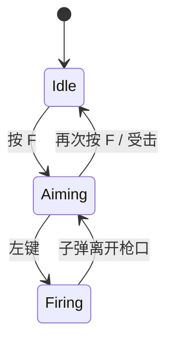

# 需求规范

> 范围：策划撰写需求文档的格式、内容、命名、协作流程。
> 适用对象：游戏策划，以及阅读需求文档的程序、美术、音频、QA。
> 与本规范配套：[项目规范](./项目规范.md)、[模块规范](./模块规范.md)、[代码规范](./代码规范.md)。

需求文档的目的是让程序/美术/音频/QA **不用回头追问** 就能照做。每一句模糊的描述、每一个 TBD，都会在排期里以工时损失加倍偿还。本规范就是为消除这类损失而存在。

---

## 1. 文档分类

按需求性质分类，每类有不同的强制章节（详见 §4.3）。

| 类型 | 前缀 | 用途 | 对应代码/资源位置 |
|---|---|---|---|
| 玩法需求 | `GP-` | 单个玩法/系统/机制 | `Assets/Scripts/GamePlay/` |
| 系统需求 | `SYS-` | 通用机制（任务/存档/成就/邮件等） | `Assets/Scripts/GamePlay/TaskSystem/` 等 |
| UI 需求 | `UI-` | 界面、交互、信息架构 | `Assets/Scripts/GamePlay/UI/`、`Resources/UI/` |
| 数值需求 | `NUM-` | 配表数值、平衡、公式 | `excel/3xlsx/`、`Resources/Config/Data/` |
| 美术需求 | `ART-` | 资源规格、风格指引 | `Assets/Art/`、`Resources/UI/` |
| 音频需求 | `AUD-` | BGM/SFX/UI 音效清单与触发点 | `Resources/`（按 `SoundMgr` 通道分类） |

跨类型的复合需求（例如"一个新玩法 + 配套 UI + 配表"）拆为多份文档，互相用 `links.related` 引用，不要塞进一份。

---

## 2. 目录与文件结构

```
Docs/Requirements/
├── README.md                       # 需求总索引（手动维护，列出全部已 Approved 文档）
├── Gameplay/
│   └── Combat/
│       ├── GP-Combat-v1.md
│       └── assets/                 # wireframe / 流程图源文件 / 截图
│           └── flow-attack.png
├── System/
│   └── Task/
│       └── SYS-Task-v1.md
├── UI/
│   └── StartPanel/
│       └── UI-StartPanel-v1.md
├── Numerical/
├── Art/
└── Audio/
```

规则：

- 每个 feature 一个目录，目录名 `PascalCase`。
- 文件名 `<前缀>-<Feature>-v<迭代号>.md`，全 ASCII，单词用 `-` 分隔，如 `GP-Combat-v1.md`。中文标题写在文档内的 `title` 字段。
- 同 feature 多版本：旧版保留并标 `status: Deprecated`，新版 `links.replaces` 指回旧版。**不允许覆盖式重写**。
- 资源（图片、流程图源文件）放 `<feature>/assets/`，正文用相对路径引用 `assets/xxx.png`。
- `Docs/Requirements/README.md` 仅做索引，每条一行：`- [GP-Combat-v1] 战斗系统 v1 — 一句话简介`。

---

## 3. 文档模板

所有需求文档使用以下骨架。**必填章节缺一不可**（§4.3 给出按类型的强制矩阵）。

### 3.1 元数据（YAML frontmatter）

```yaml
---
id: GP-Combat-v1
title: 战斗系统 v1
type: Gameplay              # Gameplay | System | UI | Numerical | Art | Audio
status: Draft               # Draft | Review | Approved | Implemented | Deprecated
owner: 张三                 # 唯一负责人
reviewers: [李四(程序), 王五(美术)]
created: 2026-05-09
updated: 2026-05-09
version: 0.1
links:
  related: [SYS-Task-v1, UI-CombatPanel-v1]
  replaces: []              # 仅在替代旧版时填写
  excel: [skill.xlsx, hero.xlsx]
  prefabs: [Resources/UI/CombatPanel]
  events: [GameEventTypes.SkillCast]
---
```

字段约束：

- `id` 与文件名（去掉 `.md`）必须一致。
- `owner` 必须是一名具体的人；不接受"策划组"。
- `created` / `updated` / 任何日期均使用绝对日期 `YYYY-MM-DD`，不写"下周三"。
- `version` 在文档进入 `Approved` 后每次实质修改进位（语义化：大改主版本号、内容修订次版本号、笔误不动）。

### 3.2 正文章节

```markdown
## 1. 概述（Overview）
一句话目标 + 三句话场景：玩家在何时、何处、为何使用本功能。

## 2. 范围（Scope）
**In Scope**：本次必须实现的功能点（要点列表）。
**Out of Scope**：明确不做、推迟的项；每条注明推迟原因或对应跟进 id。

## 3. 玩法 / 规则（Mechanics）
详细规则、状态、转换。优先用流程图 / 状态图 / 伪代码而非散文。
覆盖：主流程（happy path）+ 异常分支（玩家中断、资源不足、网络断开等）。

## 4. 数据（Data）
- 配表：列出受影响的 xlsx 文件及新增/修改的列名（不写格式细节，只写"需要这个字段"）。
- 事件：列出受影响的 `GameEventTypes` 枚举值（已有/新增分别标注）。
- 存档：列出受影响的 `DataContaner<T>`（已有/新增）。
- 配置常量：游戏内可调的全局参数（默认值 + 单位）。

## 5. UI 与交互（UI & UX）
- 入口与出口：从哪个面板进入，关闭后回到哪里。
- 关键反馈：动效、音效、飘字、震屏（写清触发条件 + 资源 path）。
- 至少一张 wireframe（手绘扫描可接受），放 `assets/`。
- 引用 `UI-*` 文档的具体面板，不重复定义。

## 6. 美术 / 音频
- 新资源清单（带规格：分辨率、时长、循环点等）。
- 复用资源清单（带 path）。

## 7. 验收标准（Acceptance Criteria）
可勾选的清单，QA 照此逐条测试：
- [ ] 主流程 1：动作 → 期望结果（含数值/文案）
- [ ] 主流程 2：…
- [ ] 异常分支 1：…
覆盖率：主流程 100% + 至少 3 条异常分支。

## 8. 风险与未决（Risks & Open Questions）
- @张三 是否做暴击？决策点：2026-05-15
- 已知风险 1：…（影响 / 缓解）

## 9. 变更记录（Changelog）
- v0.1 - 2026-05-09 - 张三 - 初稿
- v0.2 - 2026-05-12 - 张三 - 调整 §3 攻击判定时序
```

### 3.3 各类型强制章节矩阵

| 类型 \\ 章节 | 1 概述 | 2 范围 | 3 玩法 | 4 数据 | 5 UI | 6 美术/音频 | 7 验收 | 8 风险 | 9 变更 |
|---|:-:|:-:|:-:|:-:|:-:|:-:|:-:|:-:|:-:|
| Gameplay | ✅ | ✅ | ✅ | ✅ | ✅ | 按需 | ✅ | ✅ | ✅ |
| System | ✅ | ✅ | ✅ | ✅ | 按需 | 按需 | ✅ | ✅ | ✅ |
| UI | ✅ | ✅ | 按需 | ✅ | ✅（含 wireframe） | ✅ | ✅ | ✅ | ✅ |
| Numerical | ✅ | ✅ | ✅（公式） | ✅ | 按需 | — | ✅ | ✅ | ✅ |
| Art | ✅ | ✅ | — | 按需 | ✅ | ✅（资源清单） | ✅ | ✅ | ✅ |
| Audio | ✅ | ✅ | — | ✅（事件触发表） | 按需 | ✅（资源 + 通道） | ✅ | ✅ | ✅ |

✅ 强制；按需：与本次需求相关时填写；— 不要求。

---

## 4. 写作要求

### 4.1 必须

- **行为可观察**：每条规则能被他人通过游戏内行为验证。
  - 写："玩家按 F 后 0.2 秒内进入瞄准模式，HUD 出现十字准星。"
  - 不写："玩家可以瞄准。"
- **数值带单位 + 文案是终稿**：
  - 写："冷却 3 秒"、"暴击伤害 +50%"、"提示文本：再次按下取消"。
  - 不写："冷却时间不长"、"提示玩家可以取消"。
- **绝对日期**：始终 `YYYY-MM-DD`。
- **引用而非复述**：同一规则在仓库内只在一个文档里是 source of truth，其他文档用 `id` 引用。
- **指向已有模块**：UI 用 `UIMgr.Show<XxxPanel>()`、事件用 `EventMgr.Trigger(GameEventTypes.Xxx)`、存档用 `DataContaner<Xxx>`、飘字用 `FlyTextMgr.AddText`、震屏用 `CameraMgr.ShakeCamera`。具体见 [模块规范 附录 B](./模块规范.md#附录-b常用扩展场景)。
- **图优先**：流程图用 [Mermaid](https://mermaid.js.org/)（GitHub / VS Code 原生渲染）；状态图、时序图同理。能图就别写大段散文。

Mermaid 示例：

````markdown

````

### 4.2 禁止

- 禁止省略 §7 验收标准。没有验收标准 = 没有需求。
- 禁止 "TBD"、"待定"、"以后再说" 散落正文。所有未决项 **统一归入 §8 风险与未决** 并指明等谁、什么时候答复。
- 禁止描述实现细节。不写"用 Dictionary 存"、"开协程"、"用 ScriptableObject"。需求只定义 **做什么 / 边界 / 验收**，怎么做留给程序。
- 禁止跨文档重复同一规则。重复 = 后续同步成本。
- 禁止使用相对时间（"下周"、"最近"）。

### 4.3 格式

- Markdown，CommonMark 渲染（与项目其他规范一致）。
- 表格：列齐全；空格用 `—` 而非 `N/A` 或留空。
- 标题层级：`##` 起步（`#` 留给文档大标题）。
- 中英文混排：中英文之间留半角空格（"按 F"、"HP 100"）。
- 图片：``，相对路径。
- 行长：建议 ≤120 字符，超长段落拆段。

---

## 5. 协作流程

```
策划 Draft (本地)
    ↓ 自检 §6 checklist 全部满足
策划 提交 PR，status = Review
    ↓ reviewers 在 PR 评论提问 / 提建议
    ↓ 策划逐条回应、改文档、推新提交
所有问题闭合 → status = Approved，合入 main
    ↓ 程序排期实现
开发 + QA 验收通过 → 策划标 status = Implemented，归档到 changelog
```

规则：

- **Draft → Review**：策划自检 §6 全部满足后才提交 PR；不满足则 reviewers 有权直接退回。
- **Review → Approved**：所有 reviewer 显式 approve；任何一项未决问题阻塞合入。
- **Approved 后修改**：必须 `version` 进位 + `changelog` 记录 + 重新走一次 Review（哪怕只是小数值调整也要走，避免代码与文档分叉）。
- **笔误修复**：直接改、`version` 不动、`changelog` 不写。仅限拼写、错别字、链接 404。
- **Deprecated**：被新版替代时，旧版顶部加 `> 本版本已废弃，迁移至 [新版 id]`，且新版 `links.replaces` 指回。
- 文档变更与代码改动应在 **不同的 PR** 中提交：策划改文档、程序按文档实现，避免一份 PR 同时挑战需求与代码。

---

## 6. 自检与评审 Checklist

策划提交前自检 + reviewer 评审时逐条勾选：

**结构**

- [ ] 文件名、目录、`id` 三者一致，符合 §2 §3.1。
- [ ] 元数据齐全；`owner` 是具体的人；`updated` 是今天。
- [ ] 类型强制章节俱全（见 §3.3 矩阵）。

**内容**

- [ ] §1 概述能让一个未参与的人 30 秒内理解这是做什么。
- [ ] §2 范围明确列出 Out of Scope。
- [ ] §3 至少含一张图（流程 / 状态 / 时序）。
- [ ] §4 中提到的事件 / 配表 / 存档名称与代码仓库一致（已有 vs 新增分别标注）。
- [ ] §5 含 wireframe（UI 类必填）。
- [ ] §7 验收标准每条可被 QA 独立勾选；覆盖主流程 + ≥3 条异常分支。
- [ ] 所有 TBD 已归入 §8，每条都注明等谁、决策日期。
- [ ] §9 changelog 含本次修改条目。

**写作**

- [ ] 数值带单位、文案是终稿、日期是绝对日期。
- [ ] 没有"实现细节"（Dictionary / ScriptableObject / 协程等出现即扣分）。
- [ ] 没有跨文档重复定义；引用使用 `id`。

**变更**

- [ ] 若修改的是已 `Approved` 文档，`version` 已进位、`changelog` 已写。

---

## 7. 与代码仓库的对应（程序无缝对接）

策划写需求时，下表帮助预测程序的工作量与落点。**写需求时直接引用右列的术语和路径**，让程序看到需求就知道在哪里改。

| 需求里写 | 程序去这里看 / 改 |
|---|---|
| "新增 UI 面板 `XxxPanel`" | `Assets/Scripts/GamePlay/UI/XxxPanel.cs` 继承 `UIPageBase`；预制体 `Resources/UI/XxxPanel.prefab`；`GameProjectBootstrapper.ConfigureProjectUi` 注册 |
| "新增场景 `XxxScene`" | `GameSceneTypes` 加枚举 → `XxxScene : YSceneBase` → `ConfigureProjectScenes.RegisterScene<T>()` |
| "新增配表 `xxx.xlsx`" | `excel/3xlsx/xxx.xlsx` → `python tools/publish_config.py` → `ctx.Get<ConfigManager>().xxxConfig.Get(id)` |
| "新增全局事件 `OnYyy`" | `GamePlay/Event/GameEventTypes.cs` 加枚举值；`EventMgr.Add/Trigger` |
| "新增存档 `YyyData`" | `YyyData : Serializable` + `YyyContainer : DataContaner<YyyData>` → `BindStore(StoreMgr)` |
| "战斗触发飘字" | `ctx.Get<FlyTextMgr>().AddText(text, worldPos, FlyTextType.Xxx)`；预制体 `Resources/UI/FlyTextPrefab` |
| "战斗触发震屏" | `ctx.Get<CameraMgr>().ShakeCamera(duration, intensity)` |
| "新增 BGM `combat.ogg`" | `Resources/...path...`；`SoundMgr.PlayBGM(path)`；通道：Music |
| "新增 SFX" | `Resources/...path...`；`SoundMgr.PlaySFX(path)`；通道：Sfx 或 Ui |
| "新增对象池实体" | 继承 `ObjectBase, PoolItem<XxxData>`；纯数据用 `DataObjPool<T,S>` |
| "新增寻路图" | `Resources/Config/Astar/<name>` → `YAStarManager.LoadPathFinding` |

详细模块约定：[模块规范](./模块规范.md)。

---

## 附录 A：玩法需求示例骨架

```markdown
---
id: GP-Combat-v1
title: 战斗系统 v1
type: Gameplay
status: Draft
owner: 张三
reviewers: [李四(程序), 王五(美术), 赵六(QA)]
created: 2026-05-09
updated: 2026-05-09
version: 0.1
links:
  related: [UI-CombatPanel-v1, NUM-CombatBalance-v1]
  excel: [skill.xlsx]
  events: [GameEventTypes.SkillCast]
---

## 1. 概述
玩家在 `GameMainScene` 中通过近战与远程混合击败敌人，目标 30 秒内通关一个房间。

## 2. 范围
**In Scope**
- 近战普攻（按 F）
- 远程射击（按左键）
- 命中反馈：飘字 + 震屏

**Out of Scope**
- 暴击系统（v2，等 NUM-CombatBalance-v2 决策）
- 武器切换动画

## 3. 玩法 / 规则
（流程图 + 规则表）

## 4. 数据
- 配表：`skill.xlsx` 新增列 `damageType`（取值 `Physical` / `Magic`）
- 事件：新增 `GameEventTypes.SkillCast(skillId, casterId)`
- 存档：复用现有 `PlayerDataContainer`，新增字段 `lastSkillId`

## 5. UI 与交互
- 入口面板：`GameMainPanel`（已有，详见 UI-GameMain-v1）
- 命中飘字：`FlyTextType.PlayerHurt`，世界坐标
- 震屏：`ShakeCamera(0.15s, 0.1)`
- wireframe：`assets/combat-hud.png`

## 6. 美术 / 音频
- 新增 SFX：`Resources/Sfx/sword_hit.ogg`（0.3s，单声道，44.1kHz）
- 复用 BGM：`Resources/Bgm/combat_loop.ogg`

## 7. 验收标准
- [ ] 玩家按 F 后 0.1 秒内出现挥剑动画，命中敌人后敌人 HP 减少 10
- [ ] 命中时屏幕震动 0.15 秒、世界坐标处出现飘字 "10"（红色）
- [ ] 玩家按左键发射子弹，子弹飞行速度 20 m/s
- [ ] 异常：玩家在 UI 面板打开时按 F 不触发攻击
- [ ] 异常：敌人 HP ≤ 0 后不再受到伤害事件
- [ ] 异常：玩家死亡时所有攻击输入被屏蔽

## 8. 风险与未决
- @王五 近战命中判定的视觉是否需要 hit-stop？决策日期：2026-05-15
- 风险：远程子弹与寻路系统的碰撞兼容性未验证；缓解：v1 先用直线 raycast，不走 A*

## 9. 变更记录
- v0.1 - 2026-05-09 - 张三 - 初稿
```

---

## 附录 B：术语

- **需求文档**：策划产出的、定义"做什么"的文档。本规范覆盖。
- **设计文档 / 技术规范**：程序产出的、定义"怎么做"的文档。落在代码注释、PR 描述、[模块规范](./模块规范.md)。
- **配表**：`excel/3xlsx/*.xlsx`，定义数值数据的源文件。
- **面板 / 页面 / Panel**：UI 上的一个独立单元，对应 `UIPageBase` 子类。
- **场景**：业务场景，对应 `YSceneBase` 子类，由 `YSceneManager` 切换。
- **事件**：通过 `EventMgr` + `GameEventTypes` 派发的全局通知。
- **存档**：通过 `DataContaner<T>` + `StoreMgr` 持久化的数据。

---

## 附录 C：常见反例

| 反例 | 问题 | 改写 |
|---|---|---|
| "战斗手感要爽快" | 不可观察、不可验收 | "命中后 0.05 秒 hit-stop + 震屏 0.15 秒 + 飘字红色 24px" |
| "合适的冷却时间" | 数值缺失 | "技能 A 冷却 3 秒，技能 B 冷却 8 秒" |
| "用 ScriptableObject 存配置" | 描述了实现 | "配置项需要在 Editor 中可视化编辑"（程序自决用什么） |
| "下周决定" | 相对时间 | "决策日期：2026-05-15，@王五" |
| "玩家死亡见 GP-Death" 但 GP-Death 不存在 | 引用不存在的 id | 先创建 GP-Death 文档再引用，或本文档内自定义 |
| 同一个公式同时写在 GP-Combat 和 NUM-Balance | 重复定义 | 公式归 NUM-Balance；GP-Combat 写 "伤害公式见 NUM-Balance §3" |
