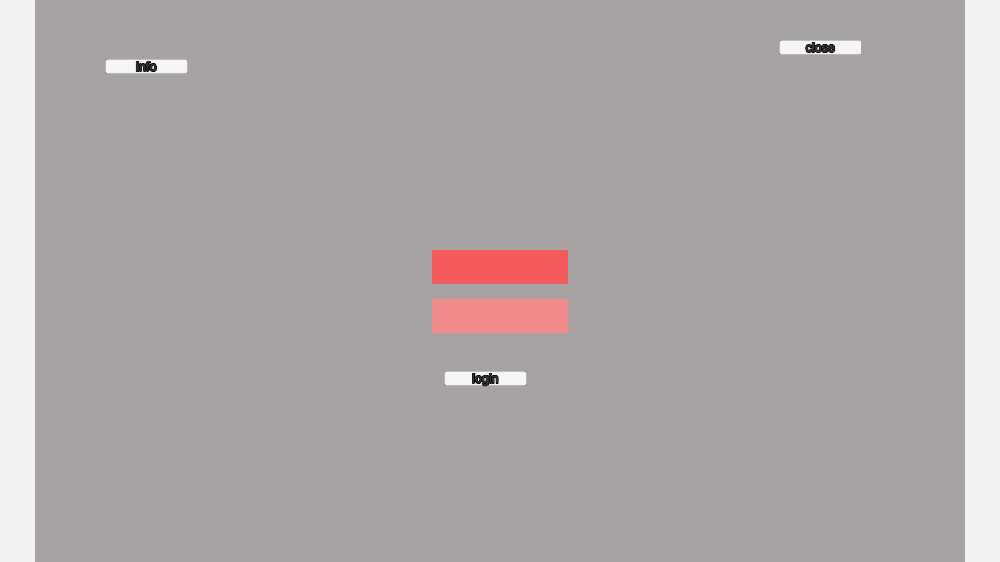

# TestUI策划案

## 1. 基础信息

- 界面 ID：TestUI
- 界面名称：TestUI
- UI 版本：43
- 生成时间：2026-05-06
- 负责人：待填写

## 2. UI 截图

## 本次 UI 变更

- 无结构变化。

## 3. 界面整体说明

### 3.1 打开入口

<!--content-begin-->
待填写。
<!--content-end-->

### 3.2 关闭规则

<!--content-begin-->
待填写。
<!--content-end-->

### 3.3 权限/等级/条件

<!--content-begin-->
待填写。
<!--content-end-->

## 4. UI 元素说明

### Image_Bg：Image_Bg

- 类型：Image
- 路径：Root/Header/Image_Bg
- 策划注释：登录背景板

#### 图片用途

<!--content-begin-->
待填写。
<!--content-end-->

#### 资源命名

<!--content-begin-->
待填写。
<!--content-end-->

#### 是否有状态变化

<!--content-begin-->
待填写。
<!--content-end-->

### button_close：button_close

- 类型：Button
- 路径：Root/Header/Image_Bg/button_close
- 策划注释：关闭按钮

#### 点击后行为

<!--content-begin-->
关闭页面
<!--content-end-->

#### 按钮文本

<!--content-begin-->
待填写。
<!--content-end-->

### button_info：button_info

- 类型：Button
- 路径：Root/Header/Image_Bg/button_info
- 策划注释：活动信息按钮

#### 点击后行为

<!--content-begin-->
待填写。
<!--content-end-->

#### 按钮文本

<!--content-begin-->
待填写。
<!--content-end-->

### Input_account：Input_account

- 类型：InputField
- 路径：Root/Header/Image_Bg/Input_account
- 策划注释：输入账号

#### 输入内容含义

<!--content-begin-->
待填写。
<!--content-end-->

#### 默认占位文案

<!--content-begin-->
待填写。
<!--content-end-->

#### 合法性校验

<!--content-begin-->
待填写。
<!--content-end-->

#### 提交或失焦行为

<!--content-begin-->
待填写。
<!--content-end-->

### Input_password：Input_password

- 类型：InputField
- 路径：Root/Header/Image_Bg/Input_password
- 策划注释：输入密码

#### 输入内容含义

<!--content-begin-->
待填写。
<!--content-end-->

#### 默认占位文案

<!--content-begin-->
待填写。
<!--content-end-->

#### 合法性校验

<!--content-begin-->
待填写。
<!--content-end-->

#### 提交或失焦行为

<!--content-begin-->
待填写。
<!--content-end-->

### button_login：button_login

- 类型：Button
- 路径：Root/Header/Image_Bg/button_login
- 策划注释：登录按钮

#### 点击后行为

<!--content-begin-->
待填写。
<!--content-end-->

#### 按钮文本

<!--content-begin-->
待填写。
<!--content-end-->

