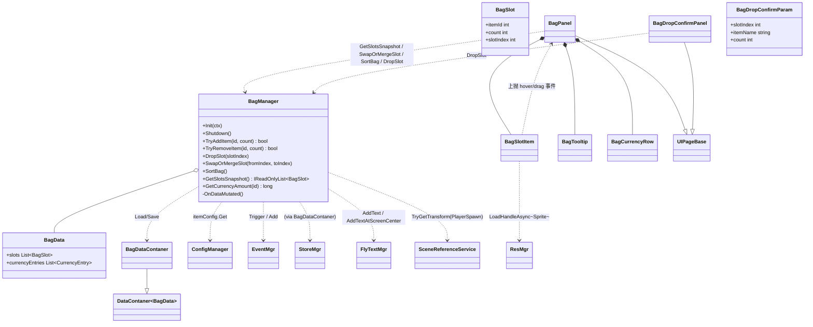
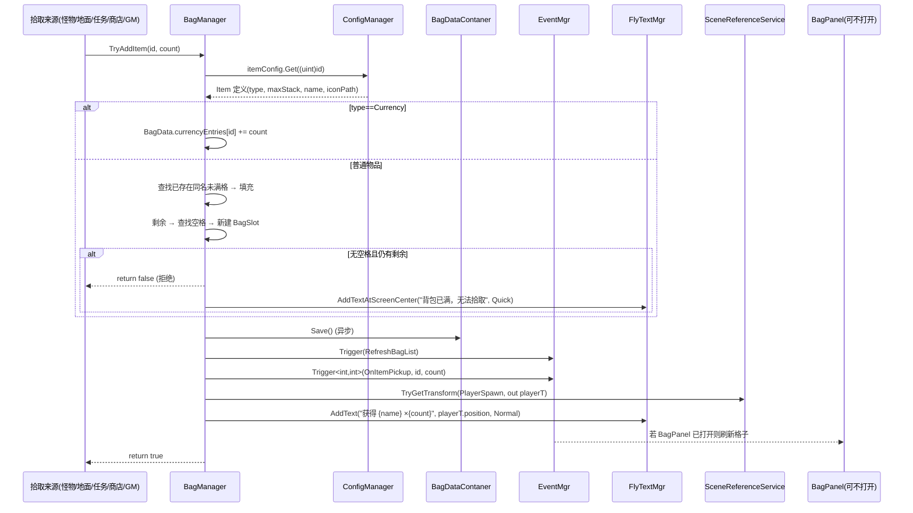
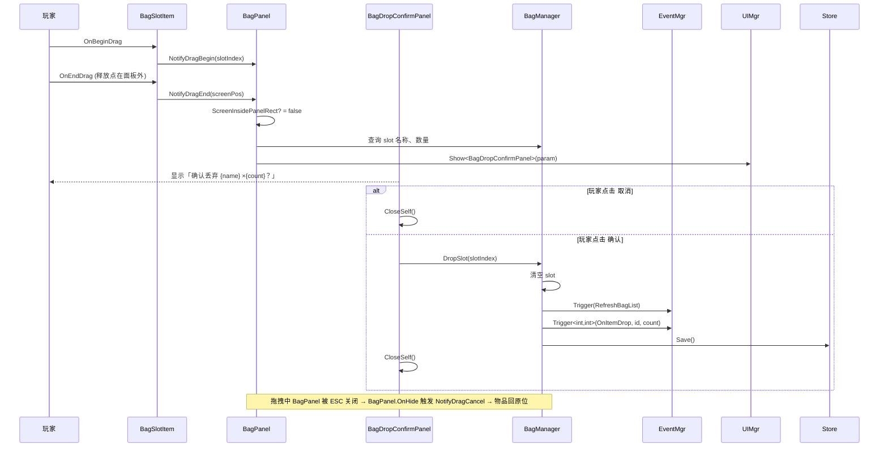

## 1. 概述

实现 `GameMainScene` 中 20 格背包（4×5 + 顶部货币栏）的纯存储能力：拾取入包、堆叠、拖拽换位 / 合并、一键整理、丢弃确认、tooltip、本地存档。

本规划基于 [SYS-Bag-v1] @ status=Approved，**仅使用现有 Framework 模块**（UIMgr / EventMgr / ConfigManager / StoreMgr / FlyTextMgr / ResMgr / Timers），不扩展 `Framework/`。

## 2. 模块映射

| 需求里的能力 | Framework 模块 | 具体 API |
|---|---|---|
| 打开 / 关闭背包面板、丢弃确认弹窗 | `UIMgr` (`IUIService`) | `Show<BagPanel>()` / `Show<BagDropConfirmPanel>(param)` / `Hide<>` / `IsShown` / `TryGetPage` |
| 背包数据变化广播；拾取 / 丢弃事件 | `EventMgr` | `Add(YOTOEventType.RefreshBagList, cb)` / `Add<int,int>(YOTOEventType.OnItemPickup, cb)` / `Trigger<int,int>(...)` |
| 物品定义读取 | `ConfigManager` (partial) | `ctx.Get<ConfigManager>().itemConfig.Get((uint)id)`（`itemConfig` 由 publish 自动生成） |
| 背包数据持久化 | `StoreMgr` + `DataContaner<BagData>` | `BagDataContaner.BindStore(StoreMgr)` → `Load(cb)` / `Save()` |
| 拾取成功飘字 `获得 {物品名} ×N` | `FlyTextMgr` | `AddText(text, worldPos, FlyTextType.Normal)` |
| 满背包提示（取舍：复用 FlyText 屏幕中心，参见 §11） | `FlyTextMgr` | `AddTextAtScreenCenter("背包已满，无法拾取", FlyTextType.Quick)` |
| 物品 / 货币图标加载 | `ResMgr` | `LoadHandleAsync<Sprite>(iconPath, handle => ...)`，配合 `BagSlotItem` 缓存 handle |
| tooltip 悬停 0.3s 触发 | `Timers.inst` | `Add(0.3f, 1, ShowTooltip)` / `Remove(ShowTooltip)` |
| 玩家世界坐标定位（飘字落点） | `SceneReferenceService` | `TryGetTransform(GameSceneRefKeys.PlayerSpawn, out var t)` |

> 说明：原策划 §5.2 写"满背包 Tips 在 `UILayerEnum.Tips` 层显示 2 秒后消失"。规划层将其降级为 `FlyTextMgr.AddTextAtScreenCenter` 的 Quick 飘字，避免新增"通用 Tips Panel"组件 —— 已记入 §11，需策划在 v2 复审是否接受该视觉。

## 3. 新增 / 修改文件清单

```
GamePlay/
├── Bag/
│   ├── BagManager.cs                        # 新增, IGameService, 背包数据中枢与对外 API
│   ├── BagData.cs                           # 新增, [Serializable], 存档结构（slots + currency）
│   ├── BagSlot.cs                           # 新增, [Serializable], 单格子数据 (id, count, slotIndex)
│   ├── BagItemType.cs                       # 新增, enum 业务侧物品分类（与 item.xlsx type 列 0~3 一致）
│   ├── BagDataContaner.cs                   # 新增, DataContaner<BagData>，SaveKey="bag_v1"
│   └── BagDropConfirmParam.cs               # 新增, BagDropConfirmPanel 启动参数（slotIndex / 文案）
├── UI/
│   └── Bag/
│       ├── BagPanel.cs                      # 新增, UIPageBase, 背包主面板（20 格 + 货币栏 + 整理按钮）
│       ├── BagSlotItem.cs                   # 新增, MonoBehaviour, 单格子 UI（含拖拽 / 悬停接口实现）
│       ├── BagTooltip.cs                    # 新增, MonoBehaviour, BagPanel 内部 tooltip 子节点（不走 UIMgr）
│       ├── BagCurrencyRow.cs                # 新增, MonoBehaviour, 顶部货币栏单条（图标 + 数量）
│       └── BagDropConfirmPanel.cs           # 新增, UIPageBase<BagDropConfirmParam>, Top 层模态丢弃确认
├── Event/
│   └── GameEventTypes.cs                    # 修改, 在 YOTOEventType 末尾追加 OnItemPickup / OnItemDrop（不重命名文件、不动既有值）
├── UI/
│   └── GameUIEnum.cs                        # 修改, 在 UIEnum 末尾追加 BagPanel / BagDropConfirmPanel（不动既有值）
└── GameProjectBootstrapper.cs               # 修改, RegisterProjectServices 注册 BagManager；ConfigureProjectUi 注册两个 Panel
```

命名说明：业务类无前缀，Panel 后缀；存档容器沿用项目历史拼写 `DataContaner`（与 `Framework/Store/StoreMgr.cs` 一致，不要写成 `DataContainer`）。

## 4. 类关系



## 5. 数据流

### 5.1 主流程：拾取入包



### 5.2 异常分支：拖拽出面板触发丢弃



## 6. 资源 / 配表 / 事件 / 存档

> **[配表] 区块仅列高级清单**。完整列结构（colID / type / target / 默认值 / 示例数据）见 `links.excel_plan` 指向的配表规划文档 [SYS-Bag-Excel-v1]，不在本文档重复。

```
[资源]
- Resources/UI/BagPanel.prefab                          (新增, @科斯魔/美术 待交付，截止 2026-05-17)
- Resources/UI/BagDropConfirmPanel.prefab               (新增, @科斯魔/美术 待交付，截止 2026-05-17)
- Resources/UI/Item/<itemId>.png 图标集                 (新增, @科斯魔/美术 待交付，截止 2026-05-17，依赖 §4.1 物品清单)
- Resources/UI/Currency/<currencyId>.png 货币图标       (新增, @科斯魔/美术 待交付，截止 2026-05-17)
- Resources/UI/FlyTextPrefab                            (复用，FlyTextMgr 内部使用)

[配表]
- excel/3xlsx/item.xlsx                                 (新增；schema 见 [SYS-Bag-Excel-v1])
  → 发布产物（自动生成，规划不写）：
      ScriptGenerated/Config/ItemConfig.cs              (含 partial ConfigManager.itemConfig)
      ScriptGenerated/Proto/Item.cs
      Resources/Config/Data/Item.bytes

[事件]
- YOTOEventType.RefreshBagList                          (已有，无参) — 背包内容变化广播
- YOTOEventType.OnItemPickup(int id, int count)         (新增，文件 GamePlay/Event/GameEventTypes.cs 末尾追加)
- YOTOEventType.OnItemDrop(int id, int count)           (新增，同上)

[存档]
- BagData (新增, [Serializable])
    - List<BagSlot> slots                  // 20 格紧凑列表，slotIndex 字段标定 0~19，未占格不入列表
    - List<CurrencyEntry> currencyEntries  // (itemId, count) 列表（JsonUtility 不支持 Dictionary 序列化，沿用 TaskInstance 的 Entry 列表模式）
- CurrencyEntry (新增, [Serializable]) { int itemId; long count; }
- BagSlot (新增, [Serializable]) { int itemId; int count; int slotIndex; }
- BagDataContaner (新增, DataContaner<BagData>, SaveKey="bag_v1")
    - 在 BagManager.Init 中 BindStore(ctx.Get<StoreMgr>()) → Load(...)
```

## 7. 注册与生命周期

### 7.1 注册位置（`GameProjectBootstrapper.cs`）

```csharp
// RegisterProjectServices(ctx)  —— 在现有注释行后追加
ctx.Register(new BagManager());

// ConfigureProjectUi(uiConfig)  —— 在现有 5 行 Register 后追加
uiConfig.Register<BagPanel>(UIEnum.BagPanel, UILayerEnum.Normal, "UI/BagPanel");
uiConfig.Register<BagDropConfirmPanel>(UIEnum.BagDropConfirmPanel, UILayerEnum.Top, "UI/BagDropConfirmPanel");
```

`UIEnum`（`GamePlay/UI/GameUIEnum.cs`）末尾追加：

```csharp
BagPanel,
BagDropConfirmPanel,
```

`YOTOEventType`（`GamePlay/Event/GameEventTypes.cs`）末尾追加：

```csharp
OnItemPickup,
OnItemDrop,
```

`YSceneType`、`UILayerEnum`、`GameSceneRefKeys`：**不改**，复用现有。

`ConfigManager` 注册：**无需手工改**。`ItemConfig` 由 `python tools/publish_config.py` 在 `ScriptGenerated/Config/ItemConfig.cs` 中以 `partial class ConfigManager` 自动注入 `itemConfig` 属性（参考 `HeroConfig.cs` 模式）。这一点已被策划在 SYS-Bag-v1 §8 列为待澄清，**程序确认无需补任何注册代码**。

### 7.2 生命周期表

| 类 | 阶段 | 动作 |
|---|---|---|
| `BagManager` | `Init(ctx)` | 缓存 ctx / configMgr / eventMgr / storeMgr / flyTextMgr / sceneRefService 字段；`new BagDataContaner()` → `BindStore` → `Load(cb)`：cb 内 `eventMgr.Trigger(RefreshBagList)`；订阅 `RefreshBagList`（无副作用，仅占位防止 page 早于 manager 初始化时丢失广播） |
| `BagManager` | `Shutdown()` | `Save()` 一次；解订阅；字段置空 |
| `BagPanel` | `OnLoad()` | `GetComponent` 缓存 ScrollView 容器、20 个 `BagSlotItem`、`BagTooltip`、`BagCurrencyRow` 池；`btnSort.onClick.AddListener(OnSortClick)`；`btnClose.onClick.AddListener(CloseSelf)` |
| `BagPanel` | `OnShow()` | `eventMgr.Add(RefreshBagList, OnRefresh)`；`OnRefresh()` 立即拉一次快照 |
| `BagPanel` | `OnHide()` | `eventMgr.Remove(RefreshBagList, OnRefresh)`；如有未结束拖拽 → `NotifyDragCancel()`；停所有 `BagSlotItem` 内的 `Timers.inst.Remove(ShowTooltip)`；释放图标 handle |
| `BagPanel` | `OnResize()` | 复算 RectTransform 边界（用于 §5.2 ScreenInsidePanelRect 判定） |
| `BagSlotItem` | `OnPointerEnter` | `Timers.inst.Add(BagTooltipDelay, 1, ShowTooltip)` |
| `BagSlotItem` | `OnPointerExit` | `Timers.inst.Remove(ShowTooltip)`；隐藏 tooltip |
| `BagSlotItem` | `OnBeginDrag/OnDrag/OnEndDrag` | 通知所属 `BagPanel`；自身 transform 跟随鼠标 |
| `BagSlotItem` | `OnDestroy` / 隐藏复用 | `iconHandle?.Dispose()` 释放图标资源 |
| `BagDropConfirmPanel` | `OnLoad()` | 绑定 `btnConfirm` / `btnCancel.onClick` |
| `BagDropConfirmPanel` | `OnBeforeShow(param)` | 填入文案 `确认丢弃 {param.itemName} ×{param.count}？丢弃后无法找回。` |
| `BagDropConfirmPanel` | `OnShow / OnHide` | 无事件订阅 |

## 8. 性能与 GC 关注点

1. `BagSlotItem.OnDrag` 是高频回调（每帧一次）：禁止 `new`、`Find`、`GetComponent`；缓存 `RectTransform`、`Camera`，跟随仅赋 `position`。
2. `BagManager.GetSlotsSnapshot()` 不要返回 `new List`：维护一个内部 `List<BagSlot>` 字段，外部用 `IReadOnlyList<BagSlot>` 接口零拷贝读；BagPanel 不要修改返回值。
3. tooltip 用 `Timers.inst.Add(0.3f, 1, cb)` + 单次回调，**不要** 在 `Update` 里轮询 `if (hoverTime > 0.3f)`。`Add` 同 callback 多次会被合并去重。
4. 物品图标 `ResMgr.LoadHandleAsync<Sprite>`：每个 `BagSlotItem` 缓存当前 handle；切换图标前 `Dispose` 旧 handle，避免引用计数泄漏。BagPanel 关闭时统一释放。
5. 排序整理：用预分配 `List<BagSlot> sortBuffer` 字段 + `Sort(comparer)`；不要 LINQ `OrderBy` / `ToList`。

## 9. 验收对齐

回到 [SYS-Bag-v1] §7，逐条标注落地位置：

**主流程**

- [ ] 进入 `GameMainScene` 后，主 HUD 显示「背包」按钮 → **由策划/美术在 GameMainPanel.prefab 上挂按钮**；点击 → `GameMainPanel.bagBtn.onClick`（已存在公开字段，本规划在 `GameMainPanel.OnLoad` 内补 `bagBtn.onClick.AddListener(() => Show<BagPanel>())`，详见 §3 修改说明追加）
- [ ] 4×5 = 20 格 + 顶部货币栏 → `BagPanel.prefab` 布局 + `BagPanel.OnRefresh` 同时刷新 slots 与 currency
- [ ] 拾取一个新物品出现新格 + 飘字 → `BagManager.TryAddItem` → `FlyTextMgr.AddText("获得 {name} ×1", playerPos, Normal)`
- [ ] 连续 5 个相同道具占 1 格、显示 5 → `BagManager.TryAddItem` 内的"查找已存在同名未满格 → 填充"分支
- [ ] 99 + 1 占 2 格 → 同上 + "剩余 → 查找空格 → 新建 BagSlot"分支（`BagStackLimit=99` 写为 `BagManager` 常量）
- [ ] 货币不占 20 格 → `BagManager.TryAddItem` 在 `type==Currency` 时走 `currencyEntries` 累加分支
- [ ] 鼠标悬停 0.3 秒 tooltip → `BagSlotItem.OnPointerEnter` → `Timers.inst.Add(BagTooltipDelay, 1, ShowTooltip)`（`BagTooltipDelay=0.3f` 常量）
- [ ] 一键整理 → `BagPanel.OnSortClick` → `BagManager.SortBag()`：内部按"同名合并 + (BagItemType, sortPriority, id) 升序"重排，最后 `Trigger(RefreshBagList)`
- [ ] 拖拽到空格 / 同名合并 / 不同物品互换 → `BagPanel.OnSlotDropped(from,to)` → `BagManager.SwapOrMergeSlot(from,to)`，规则严格按策划 §3.4 表
- [ ] 拖出面板外 → 弹模态确认 → `BagPanel.NotifyDragEnd` → `Show<BagDropConfirmPanel>(param)`；点确认 → `BagManager.DropSlot`
- [ ] 退出重启数据一致 → `BagDataContaner.Save()` 在每次 `BagManager.OnDataMutated` 后调用；`Init` 时 `Load`

**异常分支**

- [ ] 满背包拒收 + Tips 显示 → `BagManager.TryAddItem` 在"无空格且仍有剩余"分支返回 `false`，并 `FlyTextMgr.AddTextAtScreenCenter("背包已满，无法拾取", Quick)`（**规划层取舍：用 FlyText 代替策划案 §5.2 的"Tips 层 2 秒文字"，详见 §11**）
- [ ] 拖拽中按 ESC 关闭面板 → `BagPanel.OnHide.NotifyDragCancel` 重置拖拽状态、视觉物品瞬间复位
- [ ] 丢弃确认框模态阻挡 → `BagDropConfirmPanel` 注册到 `UILayerEnum.Top`（sortingOrder=100），其根节点用一张全屏透明 `Image`（`raycastTarget=true`）阻断下层 `GraphicRaycaster`，无需新增框架"模态"概念
- [ ] 整理后再拾取走主流程 → `BagManager.TryAddItem` 不会触发 `SortBag`
- [ ] 同帧多次添加 → `BagManager.TryAddItem` 是同步方法、无 await，每次调用走完整流程；`Save()` 多次调用 `StoreMgr` 内部协程串行写入

## 10. 待框架扩展（Framework Extensions Required）

**无，纯业务实现。**

校核要点：

- 模态阻挡：`UIMgr` 不提供"模态"原语，但 5 层独立 `Canvas` + `GraphicRaycaster` 已能让 Top 层全屏 Image 自然遮挡 Normal 层输入 → 业务侧解决，不需扩展。
- 满背包提示：复用 `FlyTextMgr.AddTextAtScreenCenter` + `FlyTextType.Quick`，不需新增"通用 Tips Panel"。
- tooltip：`BagPanel` 内部子节点 + `Timers.inst`，不需新增"通用 Tooltip" 框架组件。
- 配表 `itemConfig`：由 `tools/publish_config.py` 自动 partial 注入 `ConfigManager`，无需扩展 `ConfigManager.cs`。

## 11. 风险与未决

**需求层（继承自 [SYS-Bag-v1] §8）**

- @科斯魔 reviewers 未指派具体程序与 QA。决策日期：2026-05-17
- @科斯魔 wireframe 未提供，本规划 §3 类清单可继续，但 prefab 落地受阻。决策日期：2026-05-17
- @科斯魔 物品清单未提供 → 配表规划 [SYS-Bag-Excel-v1] §3 仅列 schema + 1~2 行占位示例。决策日期：2026-05-17
- @科斯魔 货币数值上限策略未定 → BagData.CurrencyEntry.count 暂用 `long` 防溢出（不影响接口）。决策日期：2026-05-17
- 任务奖励发放失败 / 商店购买失败回滚：本系统对外提供同步 `TryAddItem(id,count) -> bool`；失败回滚责任在调用方。需求层已记录。

**规划层未决**

- @科斯魔 / @策划 满背包提示视觉降级为 `FlyTextMgr.AddTextAtScreenCenter`（PopText 层 Quick 飞字），与 [SYS-Bag-v1] §5.2 写的"Tips 层固定 2 秒文字"在视觉风格上不一致。是否接受？决策日期：2026-05-17。若坚持原文则需改方案为新增 `BagFullTipsPanel` + 升 v2 规划。
- @程序 `BagPanel.NotifyDragEnd` 中"拖出面板外"判定，策划案文字含义模糊：是 `RectTransformUtility.RectangleContainsScreenPoint(panelRoot, mousePos)` 即可，还是要排除货币栏 / 整理按钮区域？规划默认采用整体 panelRoot 矩形判定。决策日期：2026-05-17

## 12. 变更记录

- v0.1 - 2026-05-10 - 程序待指派 - 初版规划，对应 [SYS-Bag-v1] @ status=Approved
