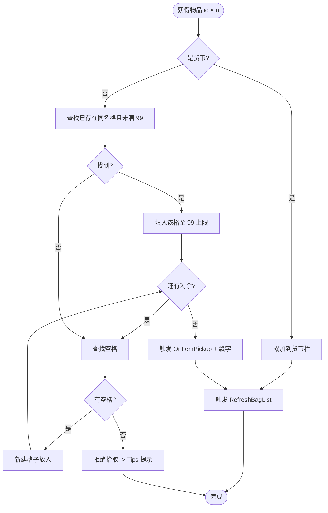
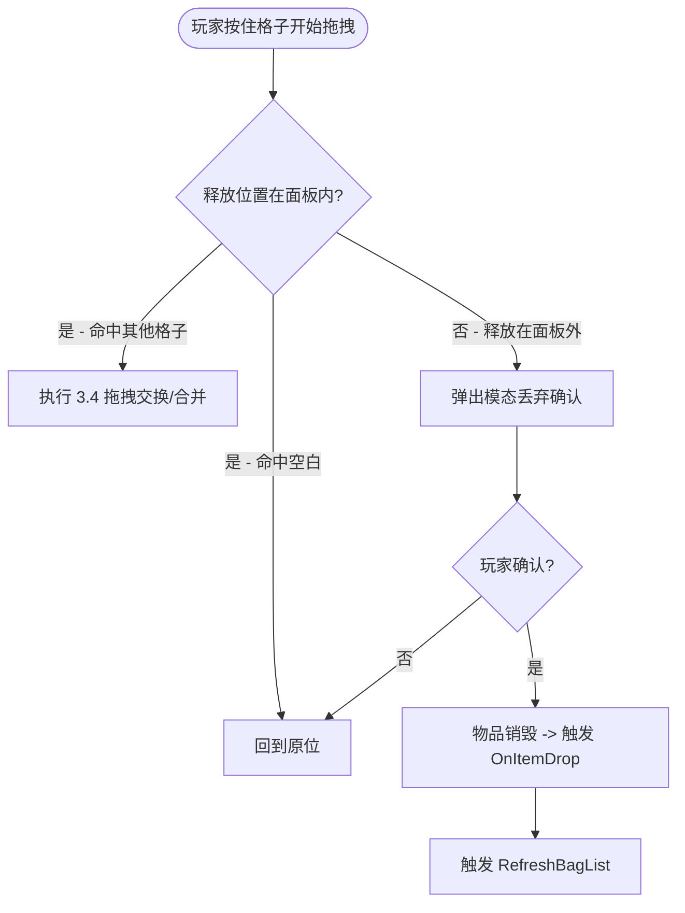

## 1. 概述

玩家在 `GameMainScene`（`YSceneType.GamePlay`）中通过背包系统**收集、查看、丢弃**通过各种途径获得的物品（道具 / 材料 / 任务物品 / 货币）。背包仅作为**纯存储**容器，不承担使用消耗品、装备穿戴、合成分解等职责。背包面板从主 HUD（`GameMainPanel`）的「背包」按钮打开，是玩家整理与查看资产的核心入口。

## 2. 范围

**In Scope**

- 20 格固定容量的网格式背包（4×5）
- 同名可堆叠物品自动堆叠，单格上限 99
- 4 种物品分类：道具 / 材料 / 任务物品 / 货币（货币不占格，独立显示）
- 5 种添加来源：怪物掉落 / 地面拾取 / 任务奖励 / 商店购买 / GM 调试指令
- 拾取时世界坐标飘字反馈
- 鼠标悬停 0.3 秒触发 tooltip（名称、描述、当前堆叠数量）
- 「一键整理」按钮：合并同名 + 按类型 / id 排序紧凑排列
- 手动拖拽交换 / 移动格子位置
- 拖出面板外释放触发丢弃，带模态二次确认
- 背包数据持久化到本地存档，重启游戏后恢复

**Out of Scope**

- 物品**使用**（消耗品、药水回血等）—— 不在本文档范围，后续另出独立需求
- **装备穿戴**与属性加成 —— 不在本文档范围，后续另出独立需求
- **合成 / 分解** —— 不在本文档范围，后续另出独立需求
- **拆分堆叠**（把一格 99 拆为 50+49）—— v1 不做，减少 UI 与交互复杂度
- **背包扩容**（道具 / 任务 / 付费途径解锁更多格子）—— v1 容量固定
- **跨角色 / 共享仓库** —— v1 仅本地单存档
- **物品稀有度颜色边框** —— v1 不做视觉品级区分
- **背包相关音效**（拾取 / 丢弃 / 满背包 / 整理）—— v1 不做音频反馈

## 3. 玩法 / 规则

### 3.1 容量与堆叠规则

| 项 | 规则 |
|---|---|
| 总格子数 | 固定 20 格（4 行 × 5 列） |
| 单格堆叠上限 | 全局统一 99 |
| 货币占格 | 否 —— 货币显示在背包面板顶部独立栏，不计入 20 格 |
| 不可堆叠物品 | v1 不存在（所有物品皆可堆叠到 99） |

### 3.2 主流程：添加物品



### 3.3 主流程：丢弃物品



- 丢弃确认文案：`确认丢弃 {物品名} ×{数量}？丢弃后无法找回。`，按钮：`确认` / `取消`。
- 丢弃为**整格**操作（v1 不支持拆分丢弃部分数量）。
- 丢弃后物品**直接销毁**，不在地面生成可拾取实体，避免与拾取来源冲突。

### 3.4 拖拽交换规则

玩家把格子 A 拖到格子 B 释放：

| B 状态 | 行为 |
|---|---|
| 空格 | A 移动到 B 位置，A 原位变空 |
| 同名物品且 B 未满 99 | 把 A 的数量并入 B（合并到 99 为止），A 剩余则保留在原位；若全部并入则 A 原位变空 |
| 同名物品且 B 已满 99 | 不发生变化，A 回到原位 |
| 不同物品 | A、B 两格内容互换位置 |

### 3.5 一键整理规则

玩家点击面板上的「整理」按钮时：

1. 同名物品全部合并（按 §3.4 同名合并规则，从前向后聚合，最后一格不足 99 也允许）
2. 按以下优先级排序后从格子 0 开始紧凑排列：
   - 一级：物品类型 `道具 < 材料 < 任务物品`（货币不参与，独立栏）
   - 二级：`item.xlsx` 的 `id` 升序
3. 触发 `YOTOEventType.RefreshBagList`

### 3.6 异常分支

| 场景 | 行为 |
|---|---|
| 背包 20 格全占且无可堆叠目标，拾取新物品 | 拒绝拾取；在 `UILayerEnum.Tips` 层显示 `背包已满，无法拾取` 共 2 秒后自动消失。物品保留在原来源（地面物品保留、任务奖励发放失败的处理见 §8） |
| 背包面板未打开时拾取物品 | 仍按 §3.2 流程加入背包；不弹面板，仅触发飘字反馈 |
| 拖拽过程中背包面板被 ESC / 其他面板关闭 | 拖拽中断，物品回到原格 |
| 玩家在丢弃确认框未关闭时再次操作背包 | 确认框为 `UILayerEnum.Top` 模态弹窗，背包面板交互被阻挡，玩家必须先选择确认或取消 |
| 同一物品被多个来源同帧添加（例：任务奖励 + 拾取） | 按到达顺序依次处理；每次都走完整 §3.2 流程，互不影响 |

## 4. 数据

### 4.1 配表

**新增** `excel/3xlsx/item.xlsx`，至少包含以下列：

| 列名 | 类型 | 说明 |
|---|---|---|
| id | int | 物品 ID（主键） |
| name | string | 显示名称（终稿文案） |
| desc | string | tooltip 描述（终稿文案） |
| type | enum | `Item` / `Material` / `Quest` / `Currency` |
| iconPath | string | 图标资源路径（相对 `Resources/`） |
| maxStack | int | 该物品堆叠上限（v1 全部固定 99，预留可调） |
| sortPriority | int | 一键整理时同类型内的排序权重（预留，v1 默认 0 → 退化为按 id） |

运行时访问：`ctx.Get<ConfigManager>().itemConfig.Get(id)`。

物品具体清单（每条 id 对应的 name / type / iconPath 等）由 owner 后续提供，列入 §8 待决。

### 4.2 事件

| 事件枚举值 | 状态 | 触发时机 | 携带参数 |
|---|---|---|---|
| `YOTOEventType.RefreshBagList` | **已有** | 背包内容变化（添加 / 丢弃 / 移动 / 整理 后） | 无（订阅方主动拉取背包当前状态） |
| `YOTOEventType.OnItemPickup` | **新增** | 物品成功加入背包后 | `(int id, int count)` |
| `YOTOEventType.OnItemDrop` | **新增** | 玩家确认丢弃物品后 | `(int id, int count)` |

订阅 / 派发使用 `EventMgr.Add` / `EventMgr.Trigger`。

### 4.3 存档

- **新增** `BagData : Serializable` —— 包含：
  - 20 格背包槽位列表（每槽位含 id、count、所在格 index）
  - 货币映射（货币 id → 数量）
- **新增** `BagDataContaner : DataContaner<BagData>` —— 在 `GameProjectBootstrapper` 中 `BindStore(StoreMgr)` 注册
- 落盘时机：每次背包变化后立即标脏；持久化节奏沿用 `StoreMgr` 默认行为

### 4.4 配置常量

| 名称 | 值 | 单位 | 说明 |
|---|---|---|---|
| `BagSlotCount` | 20 | 格 | 背包总格子数 |
| `BagStackLimit` | 99 | 个 | 全局堆叠上限 |
| `BagFullTipsDuration` | 2.0 | 秒 | 满背包 Tips 显示时长 |
| `BagTooltipDelay` | 0.3 | 秒 | 鼠标悬停后 tooltip 出现延迟 |

## 5. UI 与交互

### 5.1 入口与出口

- **入口**：`GameMainPanel` 主 HUD 上的「背包」按钮（具体位置由美术 wireframe 定，见 §5.4）
- **打开方式**：`UIMgr.Show<BagPanel>()`，层级 `UILayerEnum.Normal`，预制体 `Resources/UI/BagPanel.prefab`
- **关闭方式**：
  - 面板右上角「×」按钮
  - 按 ESC 键关闭最顶层面板
  - 切换到其他主面板时自动关闭
- **不绑定快捷键打开**

### 5.2 反馈

| 触发条件 | 反馈 |
|---|---|
| 拾取物品成功 | 在玩家世界坐标位置出现飘字 `获得 {物品名} ×{数量}`，类型 `FlyTextType.Normal`（`FlyTextMgr.AddText`） |
| 拾取时背包已满 | 在 `UILayerEnum.Tips` 层显示 `背包已满，无法拾取` 共 2 秒后自动消失 |
| 鼠标悬停在格子上 0.3 秒 | 出现 tooltip：物品名 + 描述 + 当前堆叠数量；鼠标移开立即消失 |
| 拖出面板外释放 | 在 `UILayerEnum.Top` 层弹出模态丢弃确认框（含 `确认` / `取消` 两按钮，文案见 §3.3） |

> 满背包 Tips 与丢弃确认弹窗的具体调用接口由程序在实现时决定（复用现有通道或新增组件，详见 §8）。

### 5.3 信息架构（BagPanel 内布局）

```
+------------------------------------------------+
| [货币栏：图标 数量 | 图标 数量 | ...]          |  <- 顶部独立栏
+------------------------------------------------+
| [格子0][格子1][格子2][格子3][格子4]            |
| [格子5][格子6][格子7][格子8][格子9]            |  <- 4 行 × 5 列网格
| [格子10][格子11][格子12][格子13][格子14]       |
| [格子15][格子16][格子17][格子18][格子19]       |
+------------------------------------------------+
|                       [一键整理]               |  <- 底部操作栏
+------------------------------------------------+
```

每个格子显示：物品图标 + 右下角堆叠数量（数量 1 时不显示）。

### 5.4 wireframe

> **待 owner 提供草图**：`assets/bag-panel-wireframe.png`
> 当前以 §5.3 文字描述代替；正式 Review 前需补充手绘或灰模。已列入 §8 风险，决策日期 2026-05-17。

## 6. 美术 / 音频

### 6.1 美术资源（具体清单待 owner 与美术补齐）

| 资源 | 用途 | 规格 | 状态 |
|---|---|---|---|
| `Resources/UI/BagPanel.prefab` | 背包面板预制体 | —— | 新增 |
| 物品图标集 | `item.xlsx` 每条 id 对应一张 | 128×128 PNG，透明背景 | 新增（依赖 §4.1 物品具体清单） |
| 货币图标 | 顶部货币栏 | 64×64 PNG | 新增 |
| 空格子背景 | 网格格子底图 | 96×96 9-slice | 复用现有 UI 资源（待美术确认） |

### 6.2 音频

v1 不做背包相关音效，已在 §2 Out of Scope 明确。后续如需补充由 AUD- 类需求另出。

## 7. 验收标准

**主流程**

- [ ] 进入 `GameMainScene` 后，主 HUD 显示「背包」按钮；点击按钮打开 `BagPanel`，再次点击或按 ESC 关闭
- [ ] 背包面板显示 4×5 = 20 个格子，顶部货币栏独立显示当前货币数量
- [ ] 拾取一个新物品：背包出现一个新格子，世界坐标位置飘字 `获得 {物品名} ×1`
- [ ] 连续拾取 5 个相同道具：背包仍只占 1 格，格子右下角显示 `5`
- [ ] 持续拾取相同道具至该格满 99，再拾取一个：背包占 2 格（99 + 1）
- [ ] 拾取的"货币"类物品不占 20 格，直接累加到顶部货币栏数字
- [ ] 鼠标悬停在格子上 0.3 秒后弹出 tooltip，显示物品名、描述、当前数量
- [ ] 点击「一键整理」按钮：同名物品合并、按 `道具 → 材料 → 任务物品` + id 升序紧凑排列
- [ ] 拖拽格子 A 到空格 B：A 移动到 B；A 原位变空
- [ ] 拖拽格子 A 到同名未满格 B：合并；超出 99 部分保留在 A
- [ ] 拖拽格子 A 到不同物品格 B：互换位置
- [ ] 拖拽格子拖出面板外释放：弹出模态确认框，文案 `确认丢弃 {物品名} ×{数量}？丢弃后无法找回。`，确认后该格清空
- [ ] 退出游戏后重新启动：背包格子内容、堆叠数量、货币数量与退出前一致

**异常分支**

- [ ] 背包 20 格全满且无可堆叠目标，拾取新物品：物品**不进入背包**，`UILayerEnum.Tips` 层显示 `背包已满，无法拾取` 共 2 秒后自动消失；地面拾取来源的物品保留在地面
- [ ] 拖拽过程中按 ESC 或切到其他面板关闭背包面板：拖拽中断，物品回到原格，无内容损失
- [ ] 丢弃确认框打开时点击背包内格子：背包面板交互被模态阻挡，必须先选择确认或取消
- [ ] 整理后立即拾取新物品：物品按 §3.2 主流程加入；不再次触发整理
- [ ] 同帧多次添加（任务奖励 + 拾取同时发生）：每次添加都走完整流程，结果与逐次添加一致

## 8. 风险与未决

- @科斯魔 reviewers 未指派具体程序与 QA。决策日期：2026-05-17
- @科斯魔 wireframe（手绘 / 灰模）未提供，仅有 §5.3 文字描述。决策日期：2026-05-17
- @科斯魔 各类物品（道具 / 材料 / 任务物品 / 货币）的具体清单未提供，影响 §4.1 配表初始内容与 §6 图标资源工作量。决策日期：2026-05-17
- @科斯魔 满背包 Tips 与丢弃确认弹窗：是否已有可复用的通用通道或组件？若无需要新增。决策日期：2026-05-17
- @科斯魔 `item.xlsx` 配表上线流程：是否需要程序补 `ConfigManager` 注册代码与生成步骤？参见项目规范配表流程。决策日期：2026-05-17
- 风险：**任务奖励发放失败**的处理方式未定 —— 任务系统侧需要回滚还是邮件补发？影响：与任务系统集成；缓解：v1 默认"任务系统侧自行处理失败"，背包仅返回失败结果；待任务系统侧需求出炉时再对齐
- 风险：**商店购买失败回滚** —— 商店系统调用本背包添加物品若返回失败，需回滚扣款；影响：与商店系统集成；缓解：本系统提供同步 `TryAddItem(id, count) -> bool` 接口，由商店侧决策回滚
- 风险：**货币数值上限** —— 极端累积情况下可能触达数值类型上限并溢出；缓解：v1 不对溢出做特殊处理，列入待程序与策划共同评估上限策略

## 9. 变更记录

- v0.1 - 2026-05-10 - 科斯魔 - 初稿（按新版 requirement-analysis skill 重新生成，覆盖原 v0.1 草稿）
